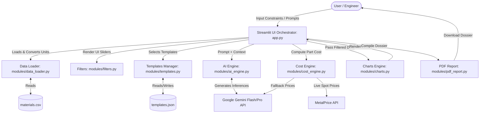
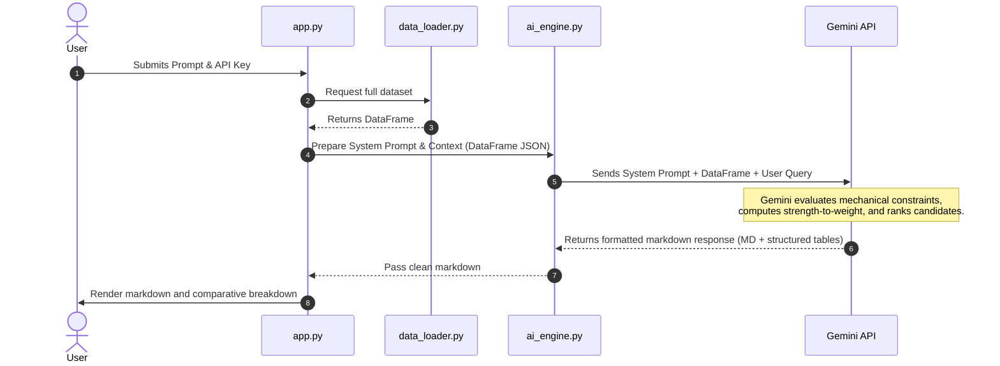
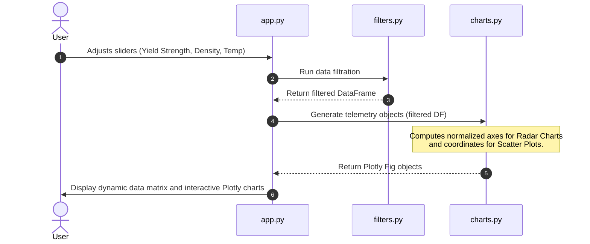
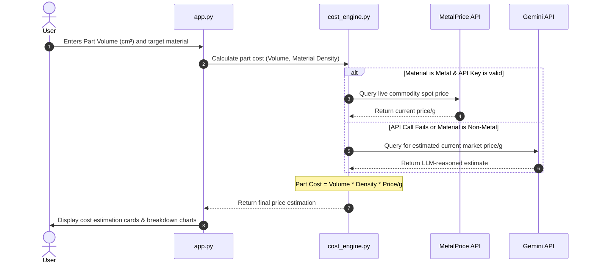
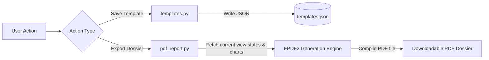

# Technical System Paper & Release Notes v1.0.0: AI-Powered Material Selection Engine

**Author:** Sanjay BP  
**Project:** AI Material Selector  
**Date:** July 2026  

---

## 1. Abstract
In engineering design, material selection is a high-dimensional optimization problem. Engineers must simultaneously balance mechanical properties (Yield Strength, Tensile Strength), thermal tolerances (Max Operating Temperature), physical properties (Density), and economic factors (Volatile commodity market pricing). 

This paper introduces the **AI Material Selector**, a system that combines a deterministic localized constraint solver with the cognitive reasoning capabilities of Google Gemini. The system automates material selection by preprocessing a localized dataset, performing multi-agent-like reasoning over conflicting trade-offs (e.g., strength-to-weight ratio vs. cost), executing real-time pricing queries via a hybrid API-estimation engine, and rendering multi-dimensional telemetry (radar, scatter, heatmaps) to assist decision-making. 

---

## 2. Introduction & Problem Statement
Engineers typically rely on static databases (e.g., Granta Design) or flat spreadsheets to find materials. However, these systems fall short in two areas:
1. **Semantic Search Limitations:** Engineers often describe requirements qualitatively (e.g., *"I need a lightweight, impact-resistant material for a drone frame flying in high-temperature environments"*). Static databases cannot parse this intent.
2. **Dynamic Volatility:** Material prices fluctuate daily. Static databases fail to account for current market pricing, leading to inaccurate part-cost estimates during early-stage prototyping.

---

## 3. System Architecture & Component Mapping

The application is built as a modular python system orchestrated via a Streamlit frontend. The diagram below illustrates the system architecture:

### Module Descriptions:
1. **`app.py`**: The central controller and UI manager. Handles state machine management (e.g., switching between Lite and Advanced modes) and sidebar controls.
2. **`modules/data_loader.py`**: Implements robust Pandas preprocessing. Loads `materials.csv`, handles missing columns, and converts unit systems (Imperial/Metric).
3. **`modules/filters.py`**: A deterministic constraint engine that renders sliders and filters data matrices based on mathematical bounds.
4. **`modules/ai_engine.py`**: Standardizes system prompts, context window formatting, and chat history. Interacts directly with the `google-genai` SDK.
5. **`modules/cost_engine.py`**: The pricing computation module. Implements a fallback logic chain: it first attempts to fetch live market rates via the MetalPrice API; if unavailable or unsupported, it queries Gemini for real-time market estimates, falling back to static CSV data.
6. **`modules/charts.py`**: Generates interactive visualization models using Plotly (Radar Charts, Scatter Plots, and Property Heatmaps).
7. **`modules/pdf_report.py`**: A report generation utility using FPDF2 to generate formal engineering dossiers containing charts, reasoning, and cost breakdowns.
8. **`modules/templates.py`**: Manages custom prompt presets stored in a local JSON structure.

---

## 4. System Workflows

The AI Material Selector relies on four primary operational workflows.

### Workflow A: AI-Reasoned Natural Language Recommendation
This workflow processes open-ended prompts (e.g., *"I need a strong but cheap material for a bike pedal"*).

### Workflow B: Parametric Filtering & Multi-Material Comparison
This workflow handles quantitative, multi-variable engineering constraints.

### Workflow C: Hybrid Cost Engineering
This workflow computes actual manufacturing part costs based on dimensions and density.

### Workflow D: Dossier Export and Template Storage
This workflow allows users to save prompts and generate offline documents.

---

## 5. Release Notes v1.0.0 (Initial Public Release)

We are proud to announce the official release of **AI Material Selector v1.0.0**. This release transforms the application from a command-line script to an enterprise-grade tactical dashboard.

### Key New Features
*   **Dual Mode Architecture (Lite & Advanced):** Introduced a clean UI split. Lite Mode features a streamlined interface focused purely on quick AI answers. Advanced Mode displays engineering tools, dynamic sliders, and full chart grids.
*   **Dynamic Cost Estimator:** Integrates live commodity prices via the `MetalPrice API` with fallbacks for plastics, ceramics, and composites using Google Gemini heuristics.
*   **Interactive Telemetry Dashboard:** Integrated Plotly charts including:
    *   *Radar Chart:* To visually compare multiple candidate materials across multiple axes (Machinability, Cost, Strength, Temp, Density).
    *   *Property Scatter Plot:* Yield Strength vs. Density with bubble sizing mapping to cost.
*   **PDF Dossier Compilation:** Generates styled engineering reports containing the selection matrices, AI reasoning, and cost estimates.
*   **JSON-based Custom Vector Templates:** Allows users to save complex constraint layouts and prompts as reusable templates.

### Visual & Performance Refinements
*   **Premium Tactical UI Theme:** Customized CSS injecting `Inter` and `JetBrains Mono` fonts, modern glassmorphism containers, subtle grey borders, and styled sidebar control groups.
*   **Google Gemini SDK Migration:** Updated backend to target the new `google-genai` SDK, utilizing `gemini-1.5-flash` for high-speed queries and `gemini-1.5-pro` for complex structural reasoning.
*   **Unit-Conversion Pipeline:** Automates data unit conversion (e.g., MPa to ksi, g/cm³ to lb/in³) under the hood.

---

## 6. Future Roadmap
*   **3D STL Viewer:** Render part files directly inside Streamlit to calculate target volume automatically from geometry.
*   **Cloud Templates Synchronization:** Sync user prompt libraries across machines using cloud databases.
*   **Database Expansion:** Adding carbon fiber composites, high-temperature superalloys, and 3D printing filaments (PLA, PETG, ABS, Nylon) to the dataset.
