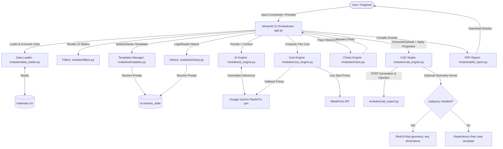
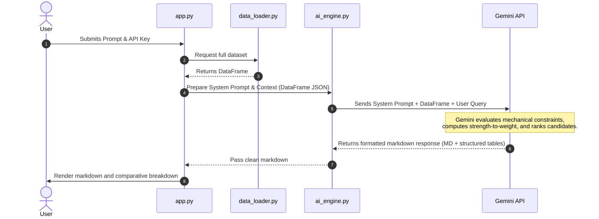
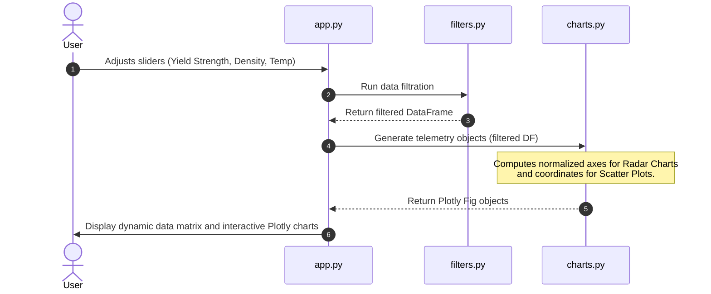
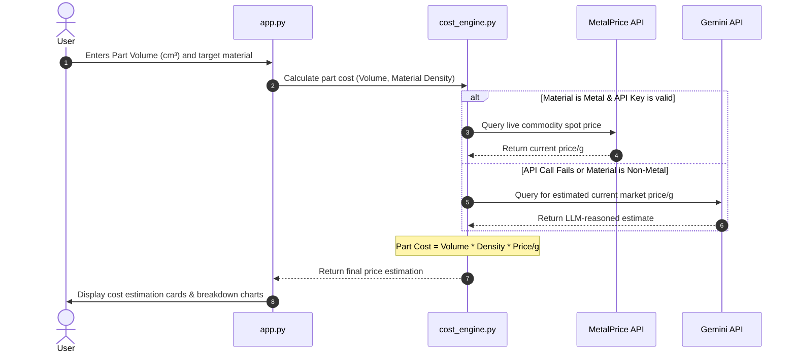
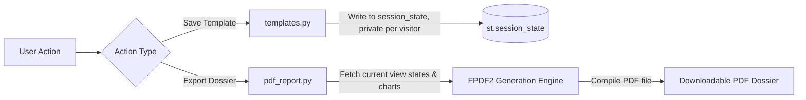
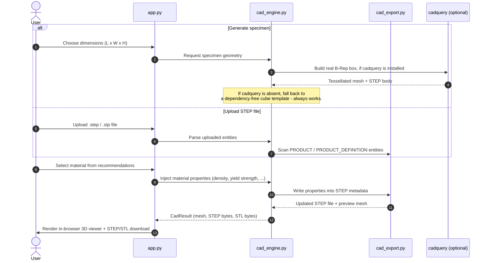

# Technical System Paper & Release Notes v1.0.0: AI-Powered Material Selection Engine

**Author:** Sanjay BP  
**Project:** AI Material Selector  
**Date:** July 2026  

---

## 1. Abstract
In engineering design, material selection is a high-dimensional optimization problem. Engineers must simultaneously balance mechanical properties (Yield Strength, Tensile Strength), thermal tolerances (Max Operating Temperature), physical properties (Density), and economic factors (Volatile commodity market pricing). 

This paper introduces the **AI Material Selector**, a system that combines a deterministic localized constraint solver with the cognitive reasoning capabilities of Google Gemini. The system automates material selection by preprocessing a localized dataset, performing multi-agent-like reasoning over conflicting trade-offs (e.g., strength-to-weight ratio vs. cost), executing real-time pricing queries via a hybrid API-estimation engine, and rendering multi-dimensional telemetry (radar, scatter, heatmaps) to assist decision-making. 

---

## 2. Introduction & Problem Statement
Engineers typically rely on static databases (e.g., Granta Design) or flat spreadsheets to find materials. However, these systems fall short in two areas:
1. **Semantic Search Limitations:** Engineers often describe requirements qualitatively (e.g., *"I need a lightweight, impact-resistant material for a drone frame flying in high-temperature environments"*). Static databases cannot parse this intent.
2. **Dynamic Volatility:** Material prices fluctuate daily. Static databases fail to account for current market pricing, leading to inaccurate part-cost estimates during early-stage prototyping.

---

## 3. System Architecture & Component Mapping

The application is built as a modular python system orchestrated via a Streamlit frontend. The diagram below illustrates the system architecture:

Note on `st.session_state`: every visitor's browser session gets its own isolated instance — nothing that touches it is ever written to a file on the server's disk. This replaced an earlier design (a shared `templates.json`/`history.db` on the server) after live testing confirmed it leaked one visitor's saved templates and search history to every other visitor of the deployment; see Section 7.

### Module Descriptions:
1. **`app.py`**: The central controller and UI manager. Handles state machine management (e.g., switching between Lite and Advanced modes) and sidebar controls.
2. **`modules/data_loader.py`**: Implements robust Pandas preprocessing. Loads `materials.csv`, handles missing columns, and converts unit systems (Imperial/Metric).
3. **`modules/filters.py`**: A deterministic constraint engine that renders sliders and filters data matrices based on mathematical bounds, clamped to the dataset's actual valid range.
4. **`modules/ai_engine.py`**: Standardizes system prompts, context window formatting, and chat history. Interacts directly with the `google-genai` SDK, with retry/fallback logic across model versions and live API-key validation.
5. **`modules/cost_engine.py`**: The pricing computation module. Implements a fallback logic chain: it first attempts to fetch live market rates via the MetalPrice API; if unavailable or unsupported, it queries Gemini for real-time market estimates, falling back to static CSV data.
6. **`modules/charts.py`**: Generates interactive visualization models using Plotly (Radar Charts, Scatter Plots, and Property Heatmaps).
7. **`modules/pdf_report.py`**: A report generation utility using FPDF2 to generate formal engineering dossiers containing charts, reasoning, and cost breakdowns.
8. **`modules/templates.py`**: Manages custom prompt presets, stored in `st.session_state` (private per visitor).
9. **`modules/history.py`**: Logs and manages the search history table (save/edit/import/export), stored in `st.session_state` (private per visitor), with spreadsheet-formula-injection sanitization on any imported or hand-edited cell.
10. **`modules/cad_engine.py`**: CAD Studio's orchestration layer. Validates inputs, dispatches to the dependency-free or `cadquery` geometry path, builds the preview mesh, and exposes one `CadResult` contract regardless of source (generated vs. uploaded).
11. **`modules/cad_export.py`**: Low-level STEP (ISO-10303-21) file generation and a format-agnostic material-property injector that works on both self-generated specimens and arbitrary uploaded STEP AP203/AP214/AP242 files.

---

## 4. System Workflows

The AI Material Selector relies on four primary operational workflows.

### Workflow A: AI-Reasoned Natural Language Recommendation
This workflow processes open-ended prompts (e.g., *"I need a strong but cheap material for a bike pedal"*).

### Workflow B: Parametric Filtering & Multi-Material Comparison
This workflow handles quantitative, multi-variable engineering constraints.

### Workflow C: Hybrid Cost Engineering
This workflow computes actual manufacturing part costs based on dimensions and density.

### Workflow D: Dossier Export and Template Storage
This workflow allows users to save prompts and generate offline documents.

### Workflow E: CAD Studio Generation, Property Injection & Export
This workflow lets an engineer turn a recommended material into a real CAD deliverable — either a freshly generated specimen or their own uploaded part.

---

## 5. Release Notes v1.0.0 (Initial Public Release)

We are proud to announce the official release of **AI Material Selector v1.0.0**. This release transforms the application from a command-line script to an enterprise-grade tactical dashboard.

### Key New Features
*   **Dual Mode Architecture (Lite & Advanced):** Introduced a clean UI split. Lite Mode features a streamlined interface focused purely on quick AI answers. Advanced Mode displays engineering tools, dynamic sliders, and full chart grids.
*   **Dynamic Cost Estimator:** Integrates live commodity prices via the `MetalPrice API` with fallbacks for plastics, ceramics, and composites using Google Gemini heuristics.
*   **Interactive Telemetry Dashboard:** Integrated Plotly charts including:
    *   *Radar Chart:* To visually compare multiple candidate materials across multiple axes (Machinability, Cost, Strength, Temp, Density).
    *   *Property Scatter Plot:* Yield Strength vs. Density with bubble sizing mapping to cost.
*   **PDF Dossier Compilation:** Generates styled engineering reports containing the selection matrices, AI reasoning, and cost estimates.
*   **Custom Vector Templates:** Allows users to save complex constraint layouts and prompts as reusable templates, private to their own session.

### Visual & Performance Refinements
*   **Premium Tactical UI Theme:** Customized CSS injecting `Inter` and `JetBrains Mono` fonts, modern glassmorphism containers, subtle grey borders, and styled sidebar control groups.
*   **Google Gemini SDK Migration:** Updated backend to target the new `google-genai` SDK, utilizing `gemini-1.5-flash` for high-speed queries and `gemini-1.5-pro` for complex structural reasoning.
*   **Unit-Conversion Pipeline:** Automates data unit conversion (e.g., MPa to ksi, g/cm³ to lb/in³) under the hood.

---

## 5a. Release Notes v2.0.0-dev (`v2.0` branch, in progress)

This branch builds on v1.0.0 with a new **CAD Studio** capability, plus the same session-privacy and XSS/CSV-injection hardening described in Section 7 (ported here from `main`).

*   **CAD Studio:** Generate a parametric specimen (a cube always works dependency-free; L x W x H boxes and true mesh tessellation unlock automatically if the optional `cadquery` package is installed) or upload an existing STEP file. Either way, the selected material's properties (density, yield strength, and more) are written directly into the STEP metadata, previewed in an in-browser three.js viewer, and downloadable as STEP or STL — ready for SolidWorks, FreeCAD, ANSYS, or SpaceClaim.
*   **Format-agnostic property injection:** `modules/cad_export.py` scans `PRODUCT` / `PRODUCT_DEFINITION` entities with a regex-based reader, so property injection works on self-generated specimens and on arbitrary uploaded STEP AP203/AP214/AP242 files alike, not just files this app produced itself.
*   **Graceful degradation:** `cadquery_available()` is checked at runtime, not assumed. Every CAD Studio feature has a working path with zero extra dependencies; `cadquery` only unlocks non-cube dimensions and full B-Rep tessellation on top of that baseline.

---

## 6. Future Roadmap
*   **Database Expansion:** Adding carbon fiber composites, high-temperature superalloys, and 3D printing filaments (PLA, PETG, ABS, Nylon) to the dataset.
*   **ASTM-standard specimen geometry:** Parametric tensile (E8) and notched-bar (Charpy) specimen generation from standard dimensions, not just cubes/boxes.
*   **FEA-ready property export:** Embed Poisson's Ratio, thermal expansion coefficient, and a yield criterion into exported STEP files alongside existing properties.
*   **Merge to `main`:** Once a throwaway Streamlit Cloud deployment confirms `cadquery` installs cleanly in that hosted environment, merge CAD Studio into `main` as the default experience for all users.

> Note: an earlier version of this roadmap listed a 3D STL viewer and cloud-synced template libraries as future work. The 3D viewer is exactly what CAD Studio (this branch) already ships. Cloud-synced templates were deliberately **not** built — after a real cross-visitor data leak was found and fixed (Section 7), templates and history were kept intentionally private and local to each browser session rather than made more widely shared.

---

## 7. Security & Privacy Hardening (Post-Launch)

After the v1.0.0 launch described above, a security review of the deployed application found and fixed several real, live vulnerabilities — not theoretical ones, each confirmed through direct testing against the running app before and after the fix. These fixes were made on `main` and ported to this `v2.0` branch so CAD Studio development never regresses on privacy or security.

| Issue | Root cause | Fix |
|---|---|---|
| API key visible to every visitor | Saved to a shared `settings.json` file on the server, read back as the default for the next visitor | Moved to `st.session_state`, private per browser session |
| Every UI setting (filters, units, mode) leaked across visitors | Same shared-file pattern, applied to all sidebar state | Same fix, applied app-wide |
| "API Connected" shown for any typed text | Status was `bool(api_key)` — true for any non-empty string | Added a format check plus a live check against Google's API |
| Search history and custom templates visible to every visitor | `history.db` (SQLite) and `templates.json` were shared server files, exportable/editable by anyone | Moved both to `st.session_state` |
| Cross-site scripting (XSS) via AI-generated text | `render_pros_cons()`/`render_status_banner()` inserted Gemini's raw output into the page as unescaped HTML | Escaped with `html.escape()` at the render sink |
| Spreadsheet formula injection via history import | Imported/edited history cells were written back out via Export as CSV/Excel with no sanitization | Cells starting with `=`, `+`, `-`, `@` are prefixed with a leading apostrophe before storage |
| Hardcoded pricing-API key in source | A real MetalPriceAPI key was committed directly in `cost_engine.py` | Removed; key now required via environment variable, old key rotated |

Every fix above was verified with an automated, repeatable test (two independent simulated visitor sessions confirming no data crosses between them, or a deliberately malicious payload confirmed neutralized) before being considered resolved.
