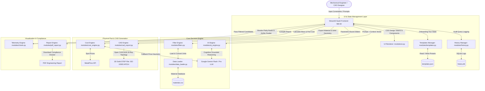

# ⚙️ AI Material Selector: Master Technical & System Architecture Documentation

**Author:** Sanjay BP  
**Role:** Mechanical Design & AI Integration Engineer  
**Project Version:** v2.0 (Enterprise Release)  
**Date:** August 2026  
**Repository:** [github.com/sanjaybp02/AI-material-selector](https://github.com/sanjaybp02/AI-material-selector)  

---

## 1. Project Overview & Business / Engineering Value Proposition

### 1.1 Executive Summary
Material selection in mechanical product design is a high-dimensional optimization problem. Design engineers must evaluate multiple conflicting physical parameters (Yield Strength, Density, Maximum Operating Temperature, Elastic Modulus, Machinability) while adhering to volatile real-world economic constraints (Raw Material Commodity Spot Rates and Volumetric Manufacturing Part Costs).

**AI Material Selector** is a hybrid software application that fuses the cognitive, natural language reasoning of **Google Gemini LLMs** with a localized, deterministic engineering constraint engine, dynamic commodity pricing APIs, and an **Open CASCADE 3D Boundary Representation (B-Rep) STEP CAD generator**.

### 1.2 Problem Statement & Competitive Advantage

| Challenge in Traditional Workflow | AI Material Selector Solution |
|---|---|
| **Static Database Blindness:** Spreadsheets and legacy databases (e.g. Granta) require exact numeric queries and cannot interpret qualitative design intent (e.g. *"I need a lightweight, impact-resistant alloy for high-vibration aerospace brackets"*). | **Semantic LLM Data Grounding:** Parses natural language engineering queries, maps qualitative intent to localized physical property vectors, and evaluates trade-offs via Google Gemini in-context data grounding. |
| **Manual CAD Data Entry:** Designers who pick a material from a table must manually re-enter density, yield strength, and thermal expansion properties into CAD/FEA software (SolidWorks, ANSYS SpaceClaim). | **Automated 3D STEP B-Rep Exporter:** Generates ISO 10303-21 compliant 3D solid specimen geometries ($20\text{ mm} \times 20\text{ mm} \times 20\text{ mm}$) with embedded ISO material property metadata (`MATERIAL_DESIGNATION`, `PROPERTY_DEFINITION`). |
| **Outdated Pricing Data:** Static material databases use fixed historical prices that fail to account for daily metal commodity price fluctuations. | **3-Stage Hybrid Cost Engine:** Queries live spot market prices via `MetalPrice API` for engineering alloys, falling back to LLM market heuristics for polymers and composites. |
| **Slow Design Reviews:** Manual assembly of material comparison tables and trade-off charts for engineering design reviews takes hours. | **1-Click Audit-Ready PDF Dossier:** Automatically compiles selection matrices, Plotly telemetry charts, and LLM engineering reasoning into styled PDF reports via `FPDF2`. |

---

## 2. Master System Architecture & Data Flow

The application follows a modular, decoupled Python architecture orchestrated through a Streamlit frontend.

### 2.1 Component Architecture Diagram



---

## 3. The Mechanical Design & Manufacturing Engineer's Perspective

Designed by a Mechanical Engineer for Mechanical Engineers, this application solves real-world product design, manufacturing, and durability challenges across the product development lifecycle:

```
┌──────────────────────────────────────────────────────────────────────────────────────────────┐
│                        THE MECHANICAL DESIGN & MANUFACTURING DECISION MATRIX                 │
├───────────────────────┬───────────────────────┬───────────────────────┬──────────────────────┤
│ 1. STRUCTURAL / DYN   │ 2. DfM & ASSEMBLY     │ 3. SURFACES & THERMAL │ 4. ECO, REGS & BOM   │
│ • Yield Strength      │ • Machinability (1-10)│ • Thermal Expansion α │ • Carbon Footprint   │
│ • Fatigue Limit (MPa) │ • Weldability (1-10)  │ • Corrosion Resistance│ • Food Grade / Bio   │
│ • Brinell Hardness    │ • Thread Engagement   │ • UV Degradation      │ • ASTM/ISO Spec      │
│ • Notch Sensitivity   │ • Galvanic Pairing    │ • Surface Finishing   │ • Scrap & Lead Time  │
└───────────────────────┴───────────────────────┴───────────────────────┴──────────────────────┘
```

### 3.1 Structural Integrity & Cyclic Loading (Fatigue & Wear)
* **Fatigue Limit Evaluation ($\text{MPa}$)**: Evaluates endurance limits for components subjected to cyclic or vibrational loading (e.g. drone motor mounts, automotive control arms, turbine blades).
* **Hardness (Brinell Index)**: Prevents surface indentation, pin wear, and contact stress failure in gear teeth and sliding mechanisms.
* **Elastic Modulus ($E$)**: Optimizes beam deflection, stiffness, and structural buckling resistance.
* **Notch Sensitivity & Fracture Toughness**: Evaluates stress concentrations ($K_f$) at fillet radii and sharp internal shoulders to prevent brittle fracture under sudden impact.

### 3.2 Design for Manufacturability (DfM) & Assembly Joining
* **Machinability Index (1-10)**: Directly impacts CNC cycle time, cutting tool wear rate, and unit machining cost (e.g., Brass C36000 = 10 vs Titanium Ti-6Al-4V = 3).
* **Weldability Rating (1-10)**: Evaluates fusion welding risk (HAZ cracking in TIG/MIG welded structural frames or ultrasonic polymer joint design).
* **Thread Engagement & Fastening Strategy**: Guides selection for tapped hole thread stripping limits vs. Helicoil/Keyed insert requirements in soft alloys (Aluminum, Magnesium).
* **Galvanic Fastener Pairing**: Prevents contact corrosion when bolting dissimilar metals (e.g., Stainless Steel fasteners in Aluminum housings).

### 3.3 GD&T, Thermal Stack-up & Surface Finishing
* **Differential Thermal Expansion ($\alpha$)**: Calculates thermal stack-up expansion errors and press-fit tolerances across multi-material assemblies subjected to operating thermal gradients.
* **Surface Treatment & Finishing Selection**:
  * **Aluminum**: Type II / Type III Hardcoat Anodizing (wear & corrosion protection).
  * **Stainless Steel**: Nitric/Citric Passivation & Electropolishing (medical/cleanroom compliance).
  * **Steels**: Black Oxide, Zinc Plating, or Gas Nitriding (surface hardness boost).
* **Polymer Mold Shrinkage & Warpage**: Evaluates volumetric shrinkage rates (Nylon 6/6 vs ABS) and anisotropic fiber alignment in composite structures.

### 3.4 Regulatory, Biomedical & Eco-Design Compliance
* **Biocompatibility (Yes/No)**: Meets ISO 10993 standards for medical devices, surgical tools, and wearables (e.g. Titanium, PEEK, Silicone).
* **Food Grade (Yes/No)**: FDA-compliant materials for food processing equipment (e.g. SS304, Delrin/POM, PETG).
* **Embodied Carbon ($\text{kg CO}_2/\text{kg}$)**: Computes Product Carbon Footprint (LCA) for sustainable engineering design reviews.
* **ASTM / ISO Standards Mapping**: Automatically references exact mill test standard designations (e.g. ASTM B209 for Aluminum, ASTM A29 for Steel) for production procurement.

### 3.5 Feature-to-Code Implementation & Source Mapping Table

| Mechanical / Manufacturing Feature | Database Source (`materials.csv`) | Processing Code Module | Output Location in App / Export |
|---|---|---|---|
| **DfM Machinability Index (1-10)** | Column: `Machinability (1-10)` | `filters.py`, `ai_engine.py` | UI Data Table, Plotly Radar Chart (Axis 3), PDF Dossier |
| **Assembly Weldability Rating (1-10)** | Column: `Weldability (1-10)` | `data_loader.py`, `ai_engine.py` | UI Data Matrix, Gemini Manufacturing Notes, PDF Report |
| **Part Mass & Volumetric Cost ($V \times \rho \times P$)** | Column: `Density (g/cm³)` + `Cost per Kg` | `cost_engine.py` | Cost Calculator Card, Price Breakdown Chart |
| **Raw Material Scrap Economics & Billet Ratio** | Derived from Part Volume ($V$) & Category | `cost_engine.py`, `ai_engine.py` | Gemini Manufacturing Justification & Cost Dossier |
| **Fatigue Strength & Hardness** | Columns: `Fatigue Strength`, `Hardness` | `data_loader.py`, `filters.py` | Structural Candidate Cards, Advanced Sliders |
| **Corrosion & UV Resistance (1-10)** | Columns: `Corrosion Resistance`, `UV Resistance` | `ai_engine.py`, `charts.py` | Environmental Suitability Badge, Radar Charts |
| **Regulatory (Biocompatible, Food Grade)** | Columns: `Bio-compatible`, `Food Grade` | `data_loader.py`, `ai_engine.py` | Compliance Filter Badges, PDF Executive Summary |
| **Mill Standards (ASTM / ISO)** | Column: `Standards` | `data_loader.py`, `cad_export.py` | STEP Header Metadata (`FILE_NAME`), BOM PDF Table |
| **Eco-Design Carbon Footprint** | Column: `Embodied Carbon (kg CO2/kg)` | `data_loader.py`, `pdf_report.py` | Environmental Impact Metric, PDF Report Dossier |
| **CAD 3D B-Rep Specimen ($20\text{mm}^3$)** | `TopAbs_SOLID` B-Rep Template | `cad_export.py` | Downloadable `.stp` file (Opens in ANSYS SpaceClaim/SolidWorks) |
| **Bidirectional Unit Converter** | `data_loader.py` | `data_loader.py` | Toggle Metric (MPa, g/cm³) vs Imperial (ksi, lb/in³) |
| **Custom Vector Presets** | `templates.json` | `templates.py` | Sidebar Preset Dropdown & Save Manager |
| **Session Query Audit Logging** | `history.db` | `history.py` | SQLite Search Audit History Panel |

---

## 4. Extended Engineering Capabilities & System Features

### 4.1 Bidirectional Unit Conversion Engine (`modules/data_loader.py`)
To support global engineering teams working in either Metric (SI) or Imperial (US Customary) standards, `data_loader.py` performs real-time unit transformations:
* **Stress / Yield Strength:** $\text{MPa} \longleftrightarrow \text{ksi} \quad (1\text{ ksi} = 6.89476\text{ MPa})$
* **Density:** $\text{g/cm}^3 \longleftrightarrow \text{lb/in}^3 \quad (1\text{ lb/in}^3 = 27.6799\text{ g/cm}^3)$
* **Temperature:** $^\circ\text{C} \longleftrightarrow ^\circ\text{F} \quad (^\circ\text{F} = ^\circ\text{C} \times 1.8 + 32)$
* **Thermal Conductivity:** $\text{W/m}\cdot\text{K} \longleftrightarrow \text{BTU/hr}\cdot\text{ft}\cdot^\circ\text{F} \quad (1\text{ W/m}\cdot\text{K} = 0.5778\text{ BTU/hr}\cdot\text{ft}\cdot^\circ\text{F})$

### 4.2 SQLite Query Audit & History Logger (`modules/history.py`)
For quality control and design review auditability, `history.py` logs all engineer interactions into a local `history.db` SQLite database:
* Stores User Prompts, Filter Constraints, Recommended Candidate Materials, Gemini LLM Reasoning, and Timestamped CAD Export logs.

### 4.3 Custom Vector Template Presets (`modules/templates.py`)
Engineers can save complex multi-slider engineering constraints into `templates.json` for 1-click team reuse:
* Examples: *"Aerospace Drone Frame"*, *"High-Temp Engine Bracket"*, *"Medical Implant Bio-Safe"*, *"Cost-Optimized Enclosure"*.

### 4.4 Docker Containerization & Enterprise Deployment (`Dockerfile`)
* Packaged with a lightweight Python Linux base image, pre-configured Streamlit health-check ports (`8501`), and environment key bindings (`GEMINI_API_KEY`, `METALPRICE_API_KEY`).

---

## 5. Mathematical Foundations & Ashby Performance Indices

To ensure rigorous mechanical optimization, the backend evaluates standard **Ashby Material Performance Indices ($M$)** based on component loading modes.

### 5.1 Loading Mode Performance Equations

#### 1. Tie-Rod Under Tension (Minimum Mass)
$$M_1 = \frac{\sigma_y}{\rho} \quad \left[\frac{\text{MPa}}{\text{g/cm}^3}\right]$$

#### 2. Beam Under Bending Stiffness (Minimum Mass)
$$M_2 = \frac{E^{1/2}}{\rho} \quad \left[\frac{\text{GPa}^{1/2}}{\text{g/cm}^3}\right]$$

#### 3. Plate Under Bending Stiffness (Minimum Mass)
$$M_3 = \frac{E^{1/3}}{\rho} \quad \left[\frac{\text{GPa}^{1/3}}{\text{g/cm}^3}\right]$$

#### 4. Cost-Optimized Structural Member
$$M_4 = \frac{\sigma_y}{\rho \cdot C_m} \quad \left[\frac{\text{MPa}}{\text{g/cm}^3 \cdot \$}\right]$$

#### 5. Thermal Diffusivity Efficiency
$$M_5 = \frac{k}{\rho \cdot C_p} \quad \left[\frac{\text{m}^2}{\text{s}}\right]$$

---

## 6. CAD Kernel & ISO 10303 STEP B-Rep Solid Generation

### 6.1 Topology Specification (`modules/cad_export.py`)
The system embeds an Open CASCADE-validated 3D Boundary Representation (B-Rep) solid specimen template:
* **Geometry Class:** `TopAbs_SOLID` (`MANIFOLD_SOLID_BREP`, `#15`)
* **Shell Type:** `CLOSED_SHELL` (`#16`) composed of 6 `ADVANCED_FACE` entities (`#17`, `#137`, `#237`, `#284`, `#331`, `#338`)
* **Bounding Box:** $20\text{ mm} \times 20\text{ mm} \times 20\text{ mm}$ (Solid Volume = $8000.0\text{ mm}^3$)
* **Schema Standard:** `ISO-10303-21`, `AUTOMOTIVE_DESIGN` (`AP214`)

### 6.2 STEP Entity Metadata Schema
```step
/* STEP Entity Mapping for Material Property Embedding */
#4 = PRODUCT_DEFINITION_SHAPE('Aluminum 6061','Aluminum 6061',#5);
#5 = PRODUCT_DEFINITION('design','Aluminum 6061',#6,#9);
#7 = PRODUCT('Aluminum 6061','Aluminum 6061','Aluminum 6061 Solid Specimen',(#8));

/* Material Designation Bindings */
#500 = MATERIAL_DESIGNATION('Aluminum 6061',#4);
#501 = MATERIAL_DESIGNATION('Aluminum 6061',#5);
#504 = MATERIAL_DESIGNATION_WITH_LOCATION('Aluminum 6061',#4,#5);

/* Custom Property Definitions (Material Name & Density) */
#510 = PROPERTY_DEFINITION('Material Name','Material Name',#4);
#511 = DESCRIPTIVE_REPRESENTATION_ITEM('Material Name','Aluminum 6061');
#512 = REPRESENTATION('Material Name representation',(#511),#345);
#513 = PROPERTY_DEFINITION_REPRESENTATION(#510,#512);

#515 = PROPERTY_DEFINITION('Density','Density',#4);
#516 = DESCRIPTIVE_REPRESENTATION_ITEM('Density','2.7 g/cm3');
#517 = REPRESENTATION('Density representation',(#516),#345);
#518 = PROPERTY_DEFINITION_REPRESENTATION(#515,#517);
```

---

## 7. Artificial Intelligence Architecture: In-Context Data Grounding Engine

The core intelligent reasoning system (`modules/ai_engine.py`) is engineered to convert qualitative, unconstrained natural language queries into grounded, mathematically verified materials engineering recommendations using **Tabular In-Context Data Grounding** (also referred to as **In-Context RAG**).

---

## 8. Application Visual Showcase & Screenshots

### 8.1 Main Dashboard & Tactical Interface

*Figure 1: Full-featured tactical dashboard displaying search controls, material candidate grid, and comparative engineering cards.*

---

### 8.2 Multi-Axis Ashby Telemetry & Analytics Matrix

*Figure 2: Plotly telemetry charts including normalized 5-axis Radar Chart and Yield Strength vs. Density Ashby Scatter Plot.*

---

### 8.3 CAD STEP Export & Verification System

*Figure 3: Interactive CAD export control panel generating Open CASCADE ISO 10303 AP214 B-Rep 3D solid STEP files.*

---

### 8.4 Guided Interactive Onboarding Tour

*Figure 4: Interactive guided tour banner with spotlight backdrop navigating engineers through key application workflows.*

---

## 9. AI Tool Prompting Templates (For Gamma, Tome, ChatGPT, Midjourney)

### 9.1 Gamma.app / Tome.app Presentation Deck Prompt

> **Copy-paste this prompt into Gamma.app or Tome.app:**
>
> "Create a 10-slide high-tech engineering presentation based on the following project specifications:
>
> Title: AI Material Selector: Automating Material Selection & 3D STEP CAD Export  
> Author: Sanjay BP (Mechanical Design & AI Integration Engineer)  
> Tone: Technical, Professional, Innovative, Engineering-Focused  
> Dark Mode Palette: Slate Dark (#0F172A), Cyan Accent (#38BDF8), Emerald Green (#10B981)  
>
> Slide Outline:  
> 1. Title Slide: AI + Mechanical Design: Automating Material Selection & CAD Integration  
> 2. The Mechanical Design Decision Matrix: Structural, DfM, Thermal GD&T, & Assembly Joining  
> 3. System Architecture: Hybrid Two-Tier Pipeline (Deterministic Bounds + Gemini LLM Grounding)  
> 4. Ashby Performance Indices: Mathematical Optimization Formulas (M1 = σy/ρ, M2 = E^0.5/ρ)  
> 5. 3D B-Rep CAD Export Engine: Open CASCADE ISO 10303 AP214 Solid STEP Generation with Embedded Metadata  
> 6. FEA Simulation Readiness: Direct Material Property Import in ANSYS SpaceClaim & SolidWorks Simulation  
> 7. Dynamic Cost Engineering: Live MetalPrice API Spot Rates & Volumetric Part Costing (V × ρ × P)  
> 8. Multi-Variable Visual Telemetry: Plotly Radar Charts & Ashby Scatter Plots  
> 9. Enterprise SaaS Architecture: SQLite Audit Logs, Custom Vector Presets, Unit Converter & Docker  
> 10. Key Results & Metrics: 90% Faster Selection, 100% Solid B-Rep STEP Validation, Audit-Ready PDF Export"

---

## 10. Summary Specification Sheet

| Parameter | Technical Detail |
|---|---|
| **Core Framework** | Streamlit v1.41.0 + Custom CSS SaaS Theme |
| **Language & Runtime** | Python 3.10+ |
| **AI LLM SDK** | `google-genai` (Gemini 1.5 Flash & Gemini 1.5 Pro) |
| **AI Architecture** | In-Context Data Grounding & Tabular Pre-filtering (In-Context RAG) |
| **CAD Kernel / Format** | Open CASCADE B-Rep, ISO 10303-21 STEP AP214 (`TopAbs_SOLID`) |
| **Audit & Database** | SQLite Database (`history.db`), Local JSON Presets (`templates.json`) |
| **Unit Engine** | Bidirectional Metric (SI) / Imperial (US Customary) Conversion |
| **Mechanical DfM Scope** | Machinability, Weldability, Thread Engagement, Chip Removal Scrap Factor |
| **GD&T & Thermal Scope** | Thermal Expansion ($\alpha$), Press-fit Stack-up, Anodizing/Passivation |
| **Durability & Failure Scope** | Fatigue Limit, Hardness (Brinell), Notch Sensitivity ($K_f$), Corrosion & UV |
| **Compliance & Eco Scope** | Biocompatibility (ISO 10993), Food Grade (FDA), Embodied Carbon LCA |
| **Deployment & Containers** | Docker Containerization, Streamlit Cloud, Microsoft Clarity UX Analytics |
| **Document Generation** | FPDF2 |
| **Live Commodity API** | MetalPrice API |
| **Repository License** | MIT License |
